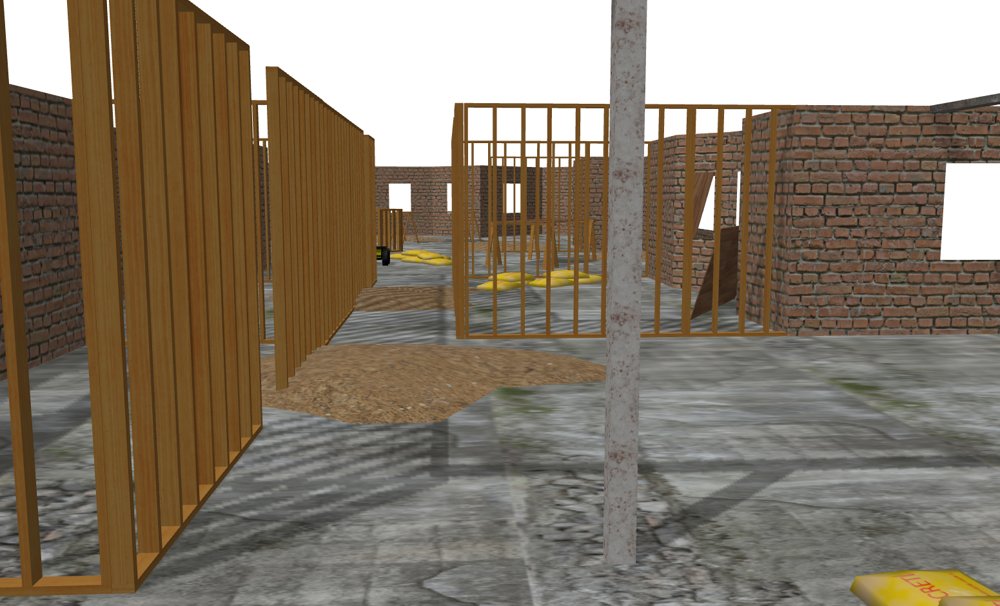
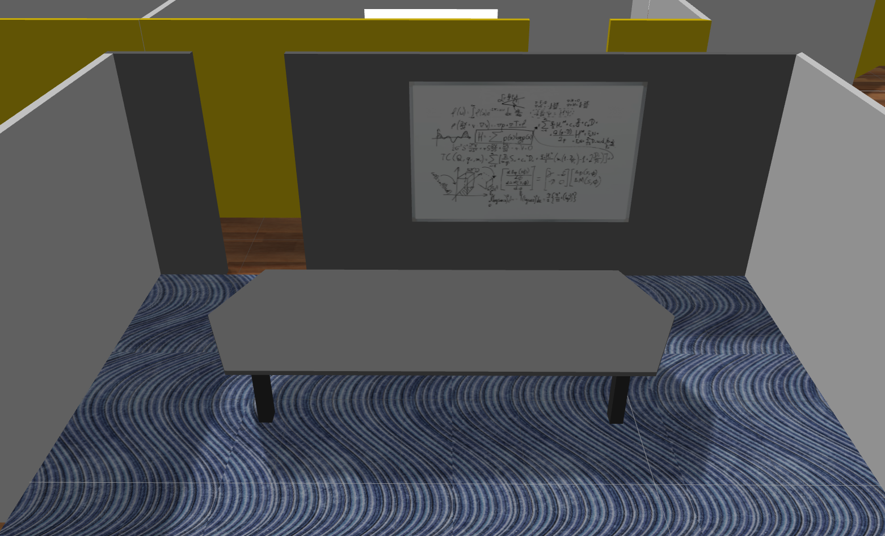
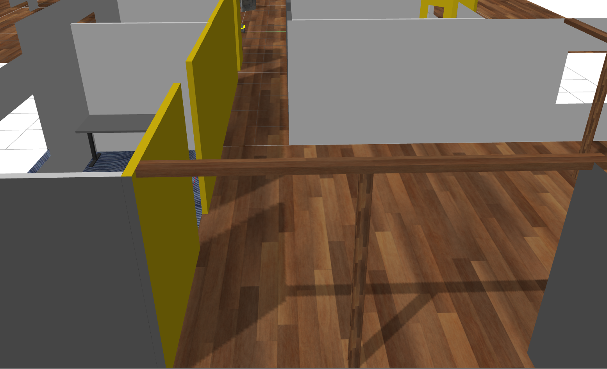
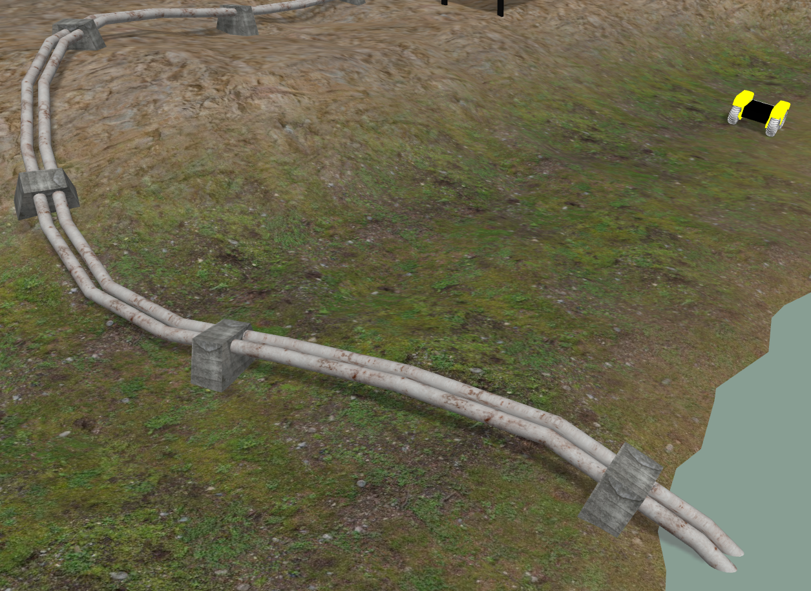
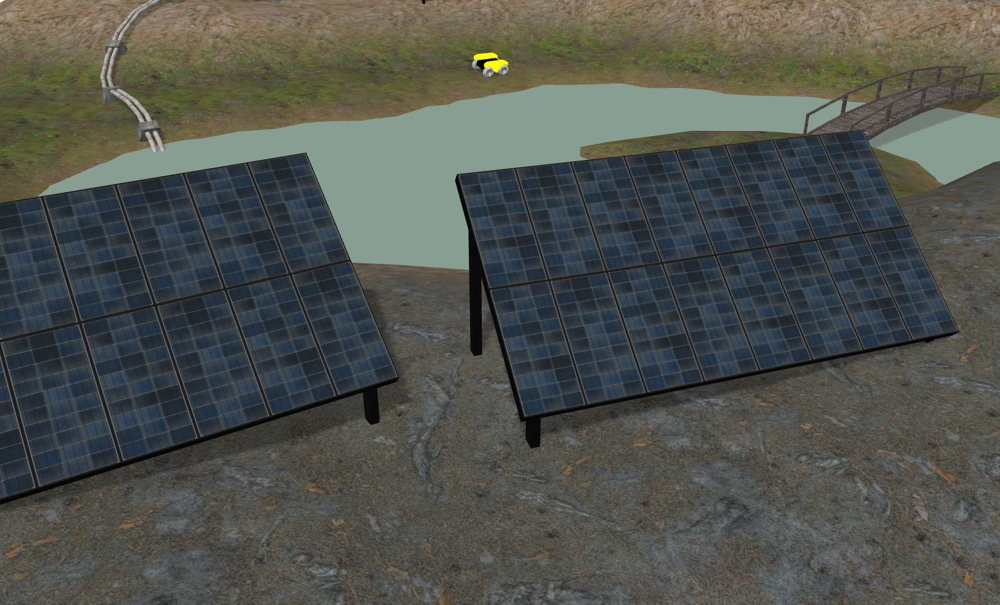
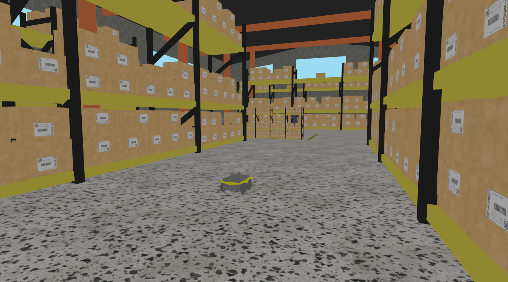

# clearpath_simulator

## Setup

Prerequisites:
  - Install [ROS 2 Jazzy](https://docs.ros.org/en/jazzy/Installation/Ubuntu-Install-Debians.html)

### Gazebo Harmonic

See [Gazebo Installation](https://gazebosim.org/docs/latest/ros_installation/) for more information
on installing Gazebo.

```
sudo apt-get install ros-${ROS_DISTRO}-ros-gz
```

### Workspace

```
mkdir ~/clearpath_ws/src -p
cd ~/clearpath_ws/src
git clone https://github.com/clearpathrobotics/clearpath_simulator.git
cd ~/clearpath_ws
rosdep install -r --from-paths src -i -y
colcon build --symlink-install
```

### Setup path

```
mkdir ~/clearpath
```

Copy your `robot.yaml` into `~/clearpath`

## Launch

```
ros2 launch clearpath_gz simulation.launch.py
```

## Worlds

The `clearpath_gz` package includes several simulation worlds. To select a specific world, use the
`world` launch parameter, e.g.
```
ros2 launch clearpath_gz simulation.launch.py world:=pipeline
```

Available worlds are:

| World                 | Description                                                                                                            |
|-----------------------|------------------------------------------------------------------------------------------------------------------------|
| `construction`        | The same floorplan as the `office` world, but under construction. Features non-solid walls and debris piles.           |
| `office`              | The same floorplan as the `construction` world. Features narrow hallways, doorways, meeting rooms, and loading docks.  |
| `orchard`             | An outdoor, agricultural environment featuring rows of trees. The terrain has small slopes, but is mostly flat.        |
| `pipeline`            | A rugged, outdoor environment featuring steeper hills, a river and bridge, a small cave, solar panels, and a pipeline. |
| `solar_farm`          | An outdoor, agricultural environmentf featuring gentle hills, a barn, rows of solar panels, and fences.                |
| `warehouse` (default) | A flat, indoor warehouse environment. Features shelves and people.                                                     |

### Screenshots

#### Consruction World




#### Office World






#### Orchard World


#### Pipeline World






#### Solar Farm World


#### Warehouse World


